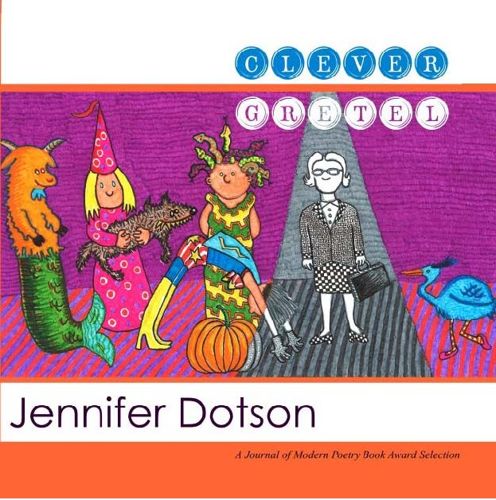

By Jennifer Dotson

Recipient of Journal of Modern Poetry First Book Award and published by Chicago Poetry Presss in April 2013.

Cover Illustration by Sue Cargill

## Praise for _Clever Gretel_

>"In Clever Gretel, Jennifer Dotson’s poems transform the straw of everyday womanhood to that which glows with the luminosity of simple truth. Utilizing a playful sense of the magically real, she sleuths for meaning-- in misplaced glasses, in the chipped veneer of Art Deco dressers, in the empty jar of celery salt, in her nightmare “plummet into space.” As a reader I peered through the window of Jennifer's words into the grace of family life and her 'fortune shone on me.'"

~ **Maureen Tolman Flannery**, author of _Ancestors in the Landscape_

>"Clever Gretel explores life's loves, losses, anxieties and joys in a voice sagacious yet candid enough to discuss acne over a latte. Even Dotson's forays into the worlds of mythology and superheroes stay grounded in the contemporary problems of junk mail and low-carb diets. In one poem the speaker says of the Muse, 'I don't remember what she looks like'-- but you will certainly find her here in this refreshing debut." 

~ **Tania Runyan**, author of _Delicious Air_ (Finishing Line Press).

[Purchase from Amazon](https://www.amazon.com/Clever-Gretel-Jennifer-Dotson/dp/0615769640/ref=sr_1_1?dchild=1&keywords=clever+gretel+by+jennifer+dotson&qid=1592663611&sr=8-1)
