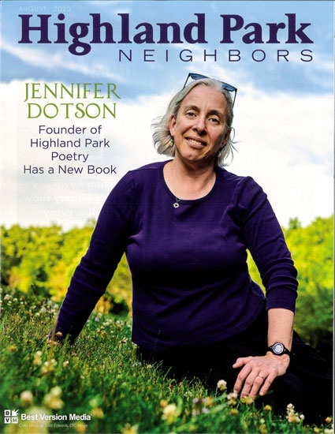

## Events/Readings –

***Late Night Talk Show Fantasy & Other Poems* Virtual Book Launch**

If you missed the Zoom event on Sunday, July 19, 2020, be sure to check out the video. Produced by Ice Hat Creative, this dynamic event hosted by Christine Hartman includes Jennifer reading select poems, performances by house band The Replicas, Q&A, trivia and more. 

 [Click here for video](https://vimeo.com/444375322)

## Workshops

***The Poet Wears a Mask: Writing the Persona Poem* for the Northwest Cultural Council**

Saturday, September 12, 2020

9AM - 12PM

A persona, from the Latin for mask, is a character taken on by a poet to speak in a first-person poem. Together we'll share examples of published persona poems and discuss strategies for succesfully writing the persona poem.

This workshop will be conducted virtually via Zoom. Advance registration is required; contact Northwest Cultural Council for information.

Jennifer facilitates workshops on writing and poetry at schools, libraries and
community groups. Please contact her for a full description of available
workshops and presentations.

## In the Media

***Highland Park Neighbors* August 2020**

