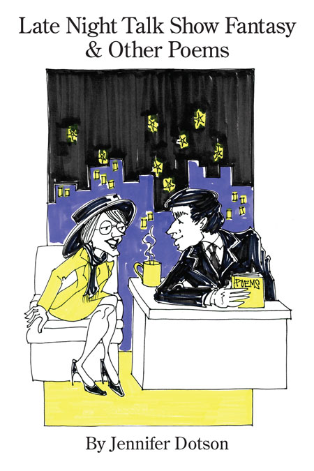

<!-- # Late Night Talk Show Fantasy & Other Poems -->

By Jennifer Dotson

Published by Kelsay Books

Cover illustration for Late Night Talk Show Fantasy & Other Poems by Cheryl Steiger

## Endorsements for _Late Night Talk Show_

>Jennifer Dotson’s poems-as-monologues range from subjects broadly cultural to
intimately personal -- say, Demeter, Jack and the Beanstalk, and the poet’s trials
with driving lessons. Delivered with self-effacing wit and deft comedic timing, the
“talk” readers encounter here arrives casually if paradoxically within an array of
traditional poetic forms. What’s notable is how transparent such forms appear, each
the apposite vessel for a poem’s chitchat.

~ **Kevin Stein**, Illinois Poet Laureate 2003-2017

>With a “guest list” that includes the Bionic Woman, Dionysus (in crisis), and a
teenaged Jesus, Late Night Talk Show Fantasy is a fun, funny, and insightful
collection perfect for curling up with in bed. Dotson’s poems are often surprising
and always accessible, inviting the reader not just as an observer, but as an engaged
participant—it’s a pleasure to join in as this “world famous poet/drinks the
champagne/and rides the bubbles.”

~ **Jan Bottiglieri**, author of _Everything Seems Significant: the Blade Runner Poems and Alloy_

>In Late Night Talk Show Fantasy & Other Poems, poet Jennifer Dotson creatively and h
humorously reweaves myths, fairy tales, lives of minor celebrities and advertising
taglines; gets personal with family secrets and driving lesson foibles; and plays
skillfully with rhymes and forms such as villanelle, Luc Bat and pantoum. In poem
after poem, from prepping for the apocalypse to wearing basic black, Dotson takes us
along on a fantastic romp through her wide range of poetic talents.

~ **Cynthia Gallaher**, author of _Epicurean Ecstasy: More Poems About Food, Drink, Herbs & Spices_ and _Frugal Poets’ Guide to Life: How to Live a Poetic Life, Even If You Aren’t a Poet_.

[Purchase direct from Kelsay Books - Preferred](https://kelsaybooks.com/products/late-night-talk-show-fantasy-other-poems?_pos=1&_sid=2a34b182f&_ss=r)

[Purchase from Amazon](https://www.amazon.com/Late-Night-Fantasy-Other-Poems/dp/1952326036/ref=sr_1_2?dchild=1&keywords=late+night+talk+show+fantasy+jennifer+dotson&qid=1592663757&sr=8-2)

>While Jennifer has not yet been invited to appear on a late night talk show, she enjoys spreading the word about what local poets are doing by hosting a 30-minute public-access program called **Poetry Today**.
